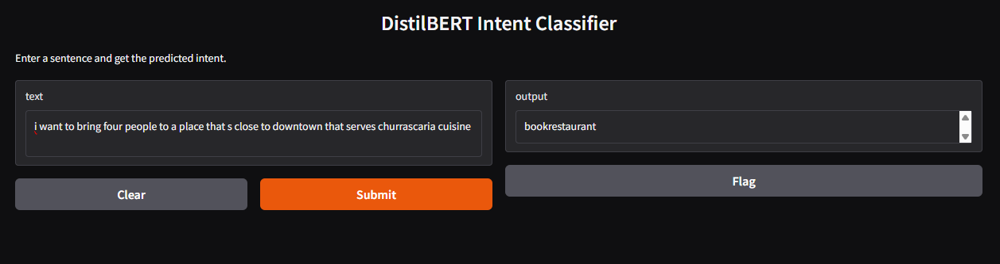

# Fine-Tuning DistilBERT for Intent Classification

## Overview

This project demonstrates how I fine-tuned **DistilBERT**, a lightweight transformer model, for an **Intent Classification task**. The goal was to build an NLP model that can understand user commands (e.g., booking a flight, checking weather, playing music) and classify them into predefined intents. After fine-tuning, I also built a **Gradio app** to provide an interactive interface for testing the model.

---

## Motivation

I chose **DistilBERT** because:

* It is smaller and faster than BERT while retaining **95% of its performance**.
* Easy to fine-tune for downstream NLP tasks.
* Well-supported by the **Hugging Face Transformers** library.
* Ideal for beginners learning fine-tuning without requiring massive compute resources.

Intent classification is a core component in building **chatbots, voice assistants, and dialogue systems**. This project gave me hands-on experience in bridging theory with practical deployment.

---

## What I Did

1. **Prepared Dataset**

   * Used a labeled dataset of text commands mapped to intents.
   * Preprocessed text using the DistilBERT tokenizer.

2. **Fine-Tuned DistilBERT**

   * Used Hugging Face `Trainer` API for training.
   * Adjusted hyperparameters (batch size, learning rate, epochs).
   * Saved checkpoints and final fine-tuned model.

3. **Evaluation & Testing**

   * Wrote a script to test the model on new unseen sentences.
   * Verified that the predictions matched expected intents.

4. **Built a Gradio App**

   * Created a simple `app.py` file with Gradio UI.
   * Users can enter text and see predicted intents instantly.
   * Gradio provides both a **local URL** and a **public shareable link**.

5. **GitHub Setup**

   * Added `.gitignore` to exclude large model checkpoints and training logs.
   * Uploaded only the essential files (code + app) to keep repo clean.

---

## What I Learned

* How to fine-tune **pre-trained transformer models** using Hugging Face.
* Importance of **tokenization** in NLP.
* How to use **Gradio** for building quick ML demos.
* Difference between **Streamlit** and **Gradio** for app deployment.
* End-to-end workflow: **data → fine-tuning → testing → deployment**.

---

## Gradio App Preview

You can interact with the model using the Gradio app. Below is a preview of the UI:



---

## Run the App

To try the Gradio app locally, run:

```bash
python app.py
```

---

## Repository Structure

```
Fine-Tuning-DistilBERT-Intent-Classification/
│-- app.py               # Gradio app
│-- main.ipynb           # Training and fine-tuning notebook
│-- requirements.txt     # Dependencies
│-- .gitignore           # Ignored files (checkpoints, results)
```

---

## Tech Stack

* Python
* Hugging Face Transformers
* PyTorch
* Gradio
* Jupyter Notebook

